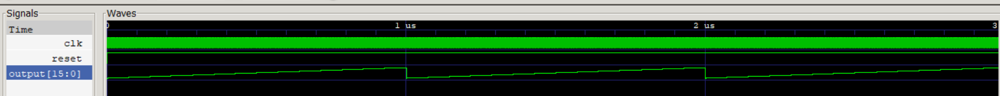

Generator of sawtooth wave written using myhdl package and converted to VHDL. 

## Structure of files:
- sawtooth_signal.py - architecture of the block generating sawtooth signal
- sawtooth_signal_tb.py - test bench for the module
- system_settings.py - class containing settings for the system: clock frequency, output signal frequency, bit width of output signal
- unit_testing.py - tests for the module
- convert_to_hdl.py - code for converting design to HDL
- exceptions.py - custom exceptions
- run_tb.py - code for running the test bench
- hdl/ - result of conversion to HDL

## Information about Python version and packages
Project was written in Python 3.8.2. Used packages and their version were put to requirements.txt file.

## Example results
Sawtooth wave obtained with settings: clock frequency 500 MHz, output signal frequency 1 MHz, 16-bit output signal. 
Visualization was done with GTKWave.

 
